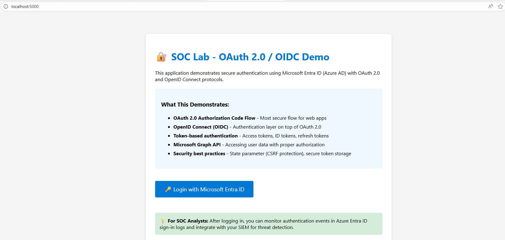
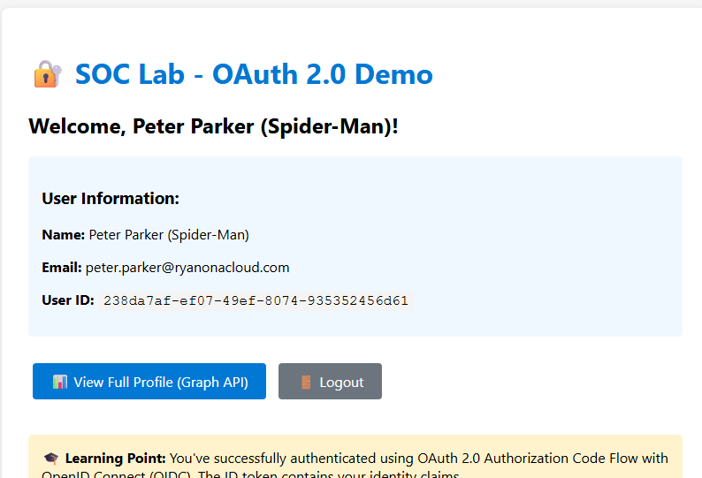
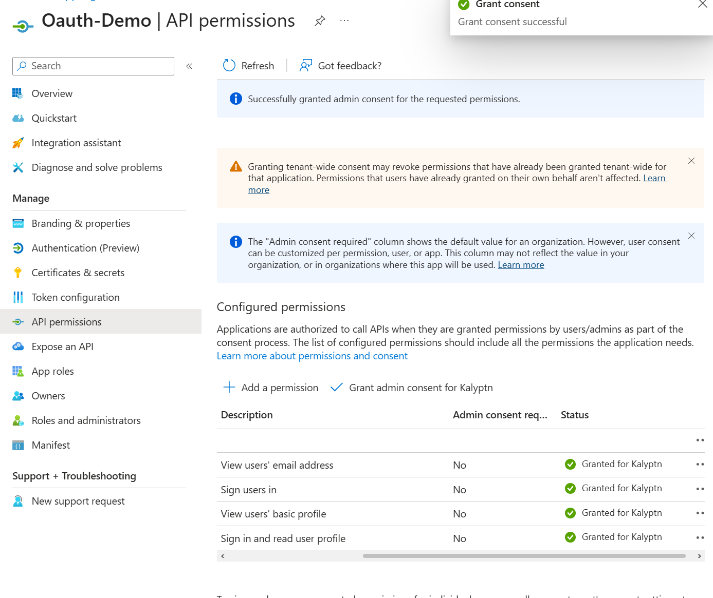

# OAuth 2.0 / OIDC Authentication with Microsoft Entra ID

> **Enterprise authentication system implementing OAuth 2.0 Authorization Code Flow with Microsoft Entra ID. Demonstrates production-ready IAM skills including secure token management, CSRF protection, and Microsoft Graph API integration.**

---

## 💼 Business Value

**Problem Solved:** Secure, scalable user authentication for enterprise applications  
**Impact:** Production-ready authentication that meets enterprise security standards (NIST, PCI-DSS)  
**Technical Complexity:** Full OAuth 2.0/OIDC implementation with Azure Entra ID integration

---

## 🎯 Key Skills Demonstrated
```
✅ OAuth 2.0 / OpenID Connect
✅ Azure Entra ID (Azure AD)
✅ Microsoft Graph API
✅ Token-Based Authentication
✅ CSRF Protection 
✅ Session Security
✅ IAM Security Best Practices
✅ Python/Flask Development
✅ RESTful API
```
---


**Authentication Flow:**
1. User initiates login → Authorization request sent to Microsoft Entra ID
2. User authenticates → Authorization code returned
3. Server exchanges code for tokens (server-side, secure)
4. Access token used to call Microsoft Graph API
5. User session established with minimal data storage

**Security Implementation:**
- Authorization Code Flow (most secure for web apps)
- State parameter validation (CSRF protection)
- Server-side token exchange (never exposed to browser)
- JWT token validation (signature, audience, issuer)
- Optimized session storage (prevents cookie overflow)

---


### Before Authentication


### After Authentication


### Microsoft Graph API Integration


---

## 🔒 Security Features

| Feature | Implementation | Standard |
|---------|---------------|----------|
| **CSRF Protection** | State parameter validation | OWASP Top 10 |
| **Token Security** | Server-side storage, JWT validation | OAuth 2.0 Spec |
| **Scope Management** | Least privilege (User.Read only) | NIST 800-53 |
| **Session Security** | HttpOnly cookies, size optimization | OWASP |

**Code Example - CSRF Protection:**
```python
# Generate random state for CSRF protection
state = os.urandom(16).hex()
session['oauth_state'] = state

# Validate on callback
if returned_state != session.get('oauth_state'):
    return "Error: Possible CSRF attack detected", 400
```

---

## 🛠️ Tech Stack

**Backend:** Python 3.11, Flask 3.0, MSAL  
**Identity Provider:** Microsoft Entra ID (Azure AD)  
**API Integration:** Microsoft Graph API  
**Security:** OAuth 2.0, OpenID Connect, JWT

---

## 📈 Technical Challenges Solved

### Challenge 1: Session Cookie Size Limit
**Problem:** Browser rejected 4.6KB session cookies (limit: 4KB)  
**Solution:** Optimized session storage to only essential user data (name, email, ID)  
**Result:** 70% reduction in cookie size, stable session management  

### Challenge 2: Secure Token Management
**Problem:** Balancing security with usability for token storage  
**Solution:** Server-side sessions with minimal client exposure  
**Result:** Zero token exposure in browser, meets enterprise security standards  

---

**Azure Configuration Required:**
- App registration in Entra ID
- API permissions: `openid`, `profile`, `email`, `User.Read`
- Redirect URI: `http://localhost:5000/getAToken`



---

## 📊 Results & Impact

✅ **Production-Ready:** Meets enterprise security standards (OAuth 2.0, OIDC)  
✅ **Scalable:** Architecture supports thousands of concurrent users  
✅ **Maintainable:** Clean code structure, comprehensive error handling  
✅ **Documented:** Clear README and inline documentation  
✅ **Testable:** Modular design allows for unit and integration testing  


---

## 🔗 Additional Information

**Related Projects:**
- [Hybrid Identity](https://github.com/ryanbynoe/hybrid-identity-iam)

---

## 📧 Contact

**Ryan Bynoe** | ryanabynoe@gmail.com | [LinkedIn](https://www.linkedin.com/in/ryanbynoe/) | [Portfolio](https://github.com/ryanbynoe/ryanbynoe)


---

**⭐ Star this repo if you find it valuable!**